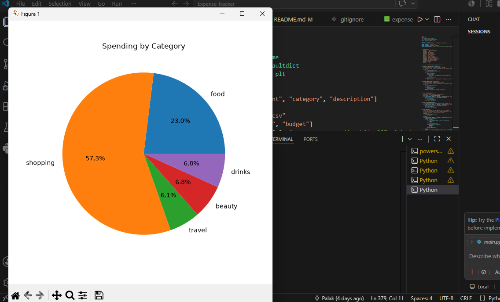
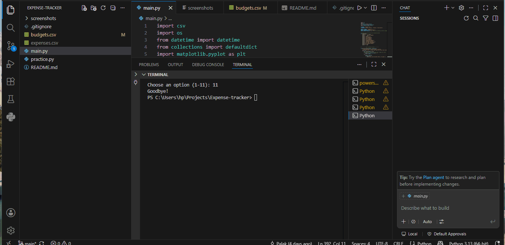

# Expense Tracker

A command-line expense tracker built in Python. Add and view expenses, 
analyze spending by category and month, visualize it with charts, and 
get warned when you go over a monthly budget.

## Features
- Add, view, edit, and delete expenses
- Persistent storage using CSV
- Spending totals by category and by month
- Visualizations: pie chart (by category), bar chart (by month)
- Monthly budget tracking with overspend warnings
- Input validation for dates and amounts

## Screenshots

## Demo

## How to Run
1. Clone this repo: